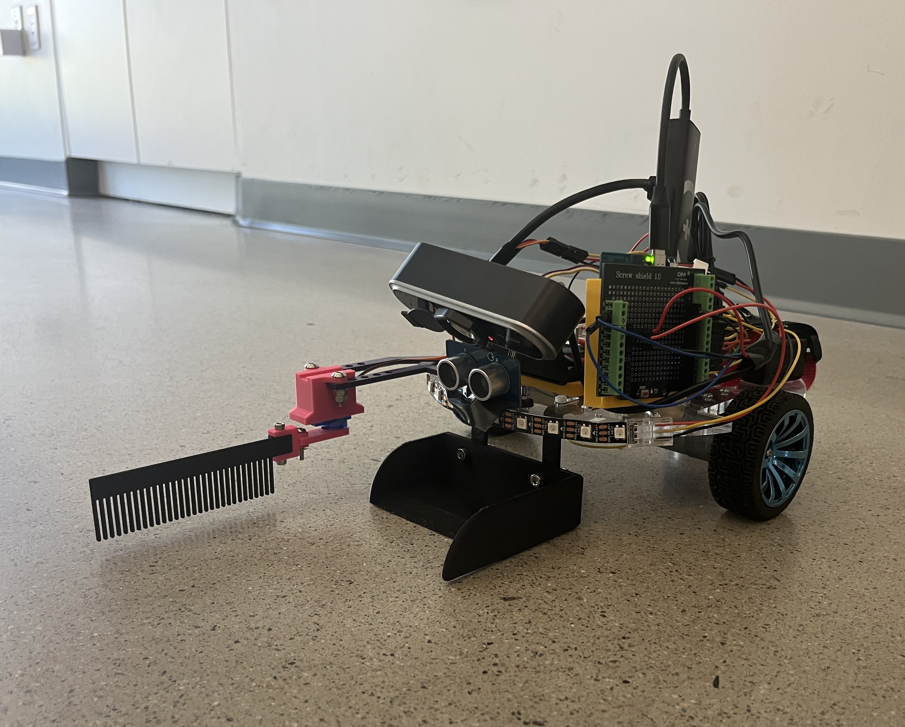

# UCSD-ECE180-SUMMER_I-Final_Project-07

<div align="center">

</div>
  
</body>

<div id="top"></div>

<h1 align="center">Anti-Shrapnel Roomba</h1>
<h4 align="center"></h4>
<!-- PROJECT LOGO -->
<div align="center">


<h3>ECE 180 Final Project</h3>
<p>
Team 7 Summer I 26'
</p>



</div>


<!-- TABLE OF CONTENTS -->
<details>
  <summary>Table of Contents</summary>
  <ol>
    <li><a href="#team-members">Team Members</a></li>
    <li><a href="#final-project">Final Project</a></li>
      <ul>
        <li><a href="#original-goals">Original Goals</a></li>
          <ul>
            <li><a href="#goals-we-met">Goals We Met</a></li>
            <li><a href="#our-hopes-and-dreams">If We Have Another Week...</a></li>
         </ul>
       </ul>
    <li><a href="#final-project-documentation">Final Project Documentation</a></li>
    <ul>
      <li><a href="#CAD-Design">CAD Design </a></li>
      <ul>
            <li><a href="#modeled-ourselves">Modeled Ourselves</a></li>
            <li><a href="#open-source-parts">Open Source Parts</a></li>
          </ul>
        <li><a href="#Software">Software</a></li>
          <ul>
            <li><a href="#how-to-run">How to Run</a></li>
          </ul>
      </ul>
    <li><a href="#authors">Authors</a></li>
    <li><a href="#acknowledgments">Acknowledgments</a></li>
    <li><a href="#contact">Contact</a></li>
  </ol>
</details>


<!-- TEAM MEMBERS -->
## Team Members

<ul>
  <li>Raul -  Electrical Engineering - '27</li>
  <li>Tristan -  Electrical Engineering - '28</li>
  <li>AnMei - Computer Engineering - '27</li>
</ul>

<!-- Final Project -->
## Final Project
<!-- put stuff here -->

<!-- Original Goals -->
### Original Goals
Our initial goal was to build a Roomba-style robot that collects small hazardous objects (like sharp objects) from a workshop or playroom. Using an Arduino Uno Q with a webcam, the robot would identify sharp objects in its path. Must-have functionality included identifying sharp objects, collecting the identified objects, tracking how many objects were collected so as not to surpass the sweeper's hardcoded limit of 1, and navigating the space independently. Nice-to-have stretch functionality included ringing an alarm once the sweeper was full, having a child/baby mode (e.g. picking up Legos), and displaying the object count.
<!--example non visible text here -->
   
<!-- End Results -->
### Goals We Met
We successfully built a robot that identifies sharp objects, collects the identified objects, and tracks how many objects are collected so as not to surpass the sweeper's limit, all while navigating spaces independently although it still has bugs and inconsistencies. This can be seen in the demo below. We also succeeded in displaying the object count, going beyond our must-haves and hitting one of our nice-to-haves. For object detection, we initially planned to use a YOLO pro nano model but found it too laggy, so we used a FOMO model instead which made slightly quicker inferences.

### If We Have Another Week...
If we had one more week, we would implement a gyro (IMU) to improve direction in robot navigation as the current build using encoders and PID is effective but not perfect. We would also add a user interface to to allow users to give a rough estimate of the play area or area to be covered by the robot as it is currently hardcoded. Additionally, we would also try to improve the accuracy of our computer vision model as only two of several trained objects were picked up with one of them being inconsistent. We would also move the current location of the ultrasonic sensor and make another mount for the ultrasonic sensor as it's currently location underneath the camera would sometimes be set off at random times. This would happen rarely but is still an issue needing to be addressed. We would also improve the design of the current brush and dustbin as the current build would sometimes cause bigger objects to not be caught. The brush needs improved griping capabilities and the dustbin just needs to be made wider.

## Final Project Documentation

<!-- Early Quarter -->
### CAD Design
<!---->

#### Modeled Ourselves
| Part | CAD Model |
|------|--------|
| Uno Q | <a href="assets/U Mount.stl"> Case Mount|
| Dustbin | <a href="assets/Dustbin.stl"> Extended Dustbin|
| Brush | <a href="assets/Comb.stl"> Brush|
| Servo | <a href="assets/Arm.stl"> Servo Arm Connector|
| Servo | <a href="assets/Hinges.stl"> Hinge to connect Comb and Servo|
| Ultrasonic Sensor | <a href="assets/Sensor Mount.stl"> Sensor Mount|


#### Open Source Parts
| Part | CAD Model |
|------|--------|
| Uno Q Case | <a href="assets/arduino-uno-q-case.3mf"> Case|
| Servo | <a href="assets/SG90%20Servo%20Mount.stl"> Mount|

### Software / App Lab setup
- Arduino App Lab, with this project's Bricks added (via App Lab's Brick UI,
  not just imported in code):
  - **Video Object Detection** -- with your trained AI model selected under
    its "AI models" tab
  - **Web UI** -- serves the camera viewer / item counter page in the browser
- `sketch/sketch.ino` requires the **Servo** library (installed automatically
  by App Lab from the sketch's library list)
- `python/main.py` requires `pygame` (for the joystick placeholder --
  currently unused by autonomous mode itself, but imported)

#### Component List
| Component | Purpose|
|------|--------|
| Arduino Uno Q | On board compute |
| SG 90 Micro Servo | To make brush do sweeping motion |
| Ultrasonic Ranger Sensor | To prevent bot from crashing into walls or furniture|
| PDB-XPW | Provide/distribute power from 3 Cell 12 V Lipo Battery to robot |
| L298N Motor Driver | Controls speed, direction, power of 2 DC motors |
| 2 JGA25-370 6V DC Motors with Encoders | Allows the robot to navigate with more precision with encoders |
| Generic 1080P 5V Webcam | Allow AI model to determine identity of objects |
| USB C Hub | Connects Arduino and Webcam to one another while also providing power from PDB |

### Wiring
| Component | Pin |
|---|---|
| Left motor ENA / IN1 / IN2 | D9 / D4 / D5 |
| Right motor ENB / IN3 / IN4 | D3 / D6 / D7 |
| Left encoder (Yellow) | D8 |
| Right encoder (Yellow) | D2 |
| Ultrasonic SIG | D10 |
| Sweeper servo | D11 |

## How to run

1. Open this project in App Lab and hit **Run**.
2. The app waits `STARTUP_DELAY_SECONDS` (currently 5s) before any movement
   starts, giving the camera stream time to come up. Use this window to open
   the WebUI in your browser (it doesn't always auto-pop-up -- see
   Troubleshooting below).
3. Movement mode is controlled by `TEST_MODE` near the top of `main.py`:

| `TEST_MODE` | What it does |
|---|---|
| `"drive"` | Drives forward `TEST_DRIVE_DISTANCE_CM` once, no camera checks |
| `"turn"` | Turns `TEST_TURN_DEGREES` in place, no camera checks |
| `"creep"` | One row, in small increments, pausing for the camera between each -- pickup/avoid/obstacle all active, with camera checks |
| `"creep2"` | Two rows (creep mode) with a turn in between, with camera checks |
| `"sweep2"` | Two rows, full continuous speed, **no** camera checks (movement/turn-geometry test only) |
| `"sweep"` | Full lawnmower coverage of the whole play area, no camera checks |

Set the mode, save, and hit Run again.

## Troubleshooting

- **WebUI doesn't auto-pop-up**: check App Lab's own preview/open link, or
  navigate to `http://localhost:7000` (or the board's network IP) manually.
  This has been unreliable but is cosmetic -- the app works fine either way.
- **Behavior doesn't match your latest code change**: do a clean rebuild
  before assuming the code is wrong:
  ```
  cd ~/ArduinoApps/autonomous-movement-with-cam
  docker compose -f .cache/app-compose.yaml down
  rm -rf .cache
  ```
  Then hit Run again in App Lab. Worth doing anytime you change Bricks,
  `app.yaml`, or the WebUI's static files (`index.html`/`app.js`).
- **Sketch fails to compile with "redefinition of ..." errors**: the file
  wasn't fully replaced when pasted -- clear `sketch/sketch.ino` completely
  before pasting in a new version, don't paste on top of existing content.


## Final Project Presentation Slides
<a href= "https://docs.google.com/presentation/d/1Zw6ZW6a8-33r7sMMGZXmiMXOQ0kt0MH9-cVSyJLGKLM/edit?usp=sharing">Final Project Demonstration Slides

## Video Demos
<a href= "https://youtube.com/shorts/Sm3MTq7GF2I?feature=share">Robot Navigating Demo

<a href= "https://youtube.com/shorts/Sm3MTq7GF2I?feature=share">Robot Avoiding Non-sharp Object Demo

<a href= "https://youtube.com/shorts/Sm3MTq7GF2I?feature=share">Robot Sweeps Sharp Object Demo

<a href= "https://youtube.com/shorts/Sm3MTq7GF2I?feature=share">Robot Fails to Sweep Sharp Object Demo

## FOMO Model
<a href= "https://studio.edgeimpulse.com/public/1059185/latest">Here 

<!-- Authors -->
## Authors

Raul, Tristan, and AnMei


<!-- ACKNOWLEDGMENTS -->
## Acknowledgments
Much appreciation to Professor Silberman, TA Jose, and classmates.


<!-- CONTACT -->
## Contact

* Raul | rbmagana@ucsd.edu
* Tristan | ttjussardi@ucsd.edu
* AnMei | adasbachprisk@ucsd.edu
